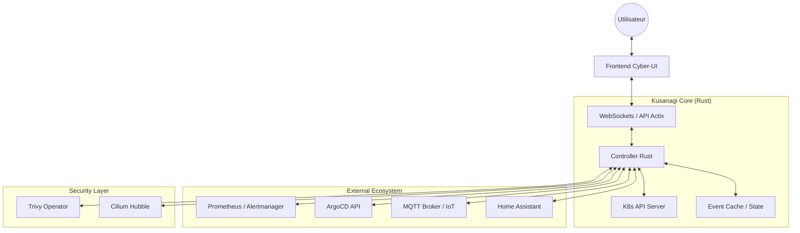

# 🕸️ Kusanagi (草薙)

**Kusanagi** est une plateforme de supervision et d'auto-remédiation pour Kubernetes, entièrement développée en **Rust**. 

Inspiré par le Major Motoko Kusanagi (*Ghost in the Shell*), ce projet ne se contente pas d'observer : il déploie une intelligence distribuée pour diagnostiquer et agir sur l'infrastructure en temps réel.

🔗 **Retrouvez-moi sur mon Little Link : [joseph.p.zacharie.org](https://joseph.p.zacharie.org/)**

---

## 🏛️ High-Level Design (HLD)

L'architecture de **Kusanagi** est conçue pour être à la fois légère, réactive et sécurisée :

### Composants Clés :
-   **Backend :** Développé avec **Actix-web** pour la performance brute et **kube-rs** pour une interaction native avec Kubernetes.
-   **Temps Réel :** Intégration massive des **WebSockets** et de **MQTT** pour une réactivité instantanée entre le cluster et l'utilisateur.
-   **Multi-Source :** Fusion de données provenant de Prometheus, ArgoCD, MQTT et Home Assistant.

---

## ✨ Features actuelles

-   **Supervision de Cluster :** Vue complète sur les Pods, Noeuds, Ingress et Evénements Kubernetes.
-   **Télémétrie Avancée :**
    *   **GPU :** Monitoring NVIDIA/DCGM (Utilisation, Température, Puissance).
    *   **Énergie :** Intégration Home Assistant (Production Solaire Enphase, Consommation Maison).
    *   **Infrastructure VPS :** Métriques système distantes.
-   **Gestion GitOps :** Synchronisation forcée et monitoring des applications **ArgoCD**.
-   **Sécurité unifiée :** Dashboard des vulnérabilités (Trivy), rapports de conformité CIS (Powerpipe) et politiques réseau (Cilium).
-   **Journalisation interactive :** Accès direct aux logs des Pods via l'interface.
-   **Interface Futuristic :** Design "Glitch/Glassmorphism" ultra-performant.

---

## 🗺️ Roadmap (Feature à venir)

-   [ ] **Autonomous Remediation v2 :** Protocoles de remédiation plus complexes via l'IA.
-   [ ] **Multi-Cluster :** Capacité à gérer plusieurs contextes Kubernetes simultanément.
-   [ ] **Alerting Avancé :** Intégration de webhooks custom et notifications push.
-   [ ] **Dark Theme Engine :** Personnalisation poussée des couleurs et animations UI.
-   [ ] **Module Backup :** Interface de gestion des sauvegardes Velero.

---

## ⚡ Pourquoi Rust ?

* **Zéro-Cost Abstractions :** Pour monitorer des clusters massifs sans consommer de CPU inutile.
* **Memory Safety :** Crucial lorsque l'on déploie des agents avec des privilèges élevés.
* **Single Binary :** Déploiement via des images Docker minimalistes (Distroless).

> *"My shell may belong to the system, but my spirit is mine."*
