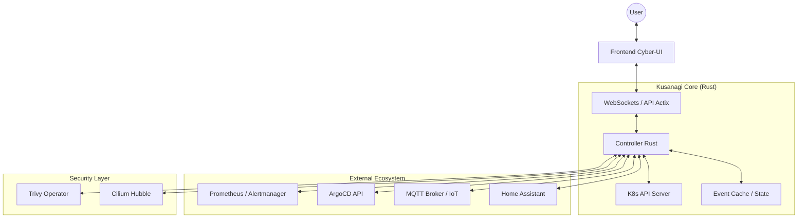

# 🕸️ Kusanagi (草薙)

**Kusanagi** is a Kubernetes monitoring and auto-remediation platform, entirely developed in **Rust**.

Inspired by Major Motoko Kusanagi (*Ghost in the Shell*), this project doesn't just observe: it deploys distributed intelligence to diagnose and act on infrastructure in real-time.

🔗 **Find me on my Little Link: [joseph.p.zacharie.org](https://joseph.p.zacharie.org/)**

---

## 🚧 Current Project Status

**⚠️ MIGRATION IN PROGRESS ⚠️**

Kusanagi is currently undergoing a major architectural migration from a monolithic legacy codebase to a clean hexagonal architecture. The project is **functional but in transition**.

### What's Working ✅
- **Ultra-Simple HTTP Server**: Basic health checks and service info endpoints
- **Docker Container**: Successfully builds and runs (fixed "Back-off restarting failed container" issue)
- **Core Infrastructure**: 37 legacy modules preserved and operational
- **Basic Monitoring**: Essential cluster status endpoints

### What's Being Migrated 🔄
- **Hexagonal Architecture**: Clean separation of domain, application, and infrastructure layers
- **Modern Rust Patterns**: Async/await, proper error handling, and type safety
- **Modular Design**: Breaking down monolithic components into focused services
- **Clean Dependencies**: Removing unnecessary external dependencies

### Current Build Status
```bash
# Working minimal version
docker build -f Dockerfile.simple -t kusanagi:debug .
docker run --rm -p 8080:8080 kusanagi:debug

# Available endpoints:
# GET /        - Service information
# GET /health  - Health check
```

---

## 🏛️ Target Architecture (Post-Migration)

The **Kusanagi** architecture is designed to be lightweight, reactive, and secure:



### Key Components:
- **Backend**: Built with **Actix-web** for raw performance and **kube-rs** for native Kubernetes interaction
- **Real-Time**: Massive integration of **WebSockets** and **MQTT** for instant reactivity between cluster and user
- **Multi-Source**: Data fusion from Prometheus, ArgoCD, MQTT, and Home Assistant

---

## ✨ Planned Features (Post-Migration)

- **Cluster Monitoring**: Complete view of Pods, Nodes, Ingress, and Kubernetes Events
- **Advanced Telemetry**:
  - **GPU**: NVIDIA/DCGM monitoring (Usage, Temperature, Power)
  - **Energy**: Home Assistant integration (Enphase Solar Production, Home Consumption)
  - **VPS Infrastructure**: Remote system metrics
- **GitOps Management**: Forced synchronization and **ArgoCD** application monitoring
- **Unified Security**: Vulnerability dashboard (Trivy), CIS compliance reports (Powerpipe), and network policies (Cilium)
- **Interactive Logging**: Direct Pod log access via interface
- **Futuristic Interface**: Ultra-performant "Glitch/Glassmorphism" design

---

## 🗺️ Migration Roadmap

### Phase 1: Foundation ✅
- [x] Fix container startup issues
- [x] Establish basic HTTP server
- [x] Preserve legacy module compatibility
- [x] Create clean Docker build process

### Phase 2: Core Architecture 🔄
- [ ] Complete hexagonal architecture implementation
- [ ] Migrate Kubernetes client integration
- [ ] Implement proper async patterns
- [ ] Add comprehensive error handling

### Phase 3: Feature Restoration 📋
- [ ] Restore Prometheus integration
- [ ] Rebuild ArgoCD monitoring
- [ ] Implement WebSocket real-time updates
- [ ] Add security scanning integration

### Phase 4: Enhancement 🚀
- [ ] **Autonomous Remediation v2**: Complex AI-driven remediation protocols
- [ ] **Multi-Cluster**: Ability to manage multiple Kubernetes contexts simultaneously
- [ ] **Advanced Alerting**: Custom webhook integration and push notifications
- [ ] **Dark Theme Engine**: Advanced UI color and animation customization

---

## ⚡ Why Rust?

- **Zero-Cost Abstractions**: Monitor massive clusters without wasting CPU cycles
- **Memory Safety**: Critical when deploying agents with elevated privileges
- **Single Binary**: Deployment via minimal Docker images (Distroless)
- **Performance**: Native speed for real-time cluster operations

---

## 🚀 Quick Start (Current State)

### Prerequisites
- Docker
- Kubernetes cluster (for full functionality post-migration)

### Running the Current Version
```bash
# Clone the repository
git clone <repository-url>
cd Kusanagi

# Build and run the minimal version
docker build -f Dockerfile.simple -t kusanagi:debug .
docker run --rm -p 8080:8080 kusanagi:debug

# Test endpoints
curl http://localhost:8080/         # Service info
curl http://localhost:8080/health   # Health check
```

### Configuration (Post-Migration)
```bash
# Environment variables
export KUSANAGI_SERVER_PORT=8080
export KUSANAGI_PROMETHEUS_URL=http://prometheus:9090
export KUSANAGI_DEV_MODE=true

# Or create kusanagi.toml
# See kusanagi.example.toml for full example
```

---

## 🤝 Contributing

This project is in active migration. Contributions are welcome, especially:
- Hexagonal architecture implementation
- Async/await pattern improvements
- Error handling enhancements
- Documentation updates

---

## 📄 License

This project is licensed under the MIT License.

---

> *"My shell may belong to the system, but my spirit is mine."*
> 
> — Major Motoko Kusanagi

**Status**: 🔄 **Migration in Progress** | **Container**: ✅ **Working** | **Legacy Modules**: ✅ **37 Preserved**
