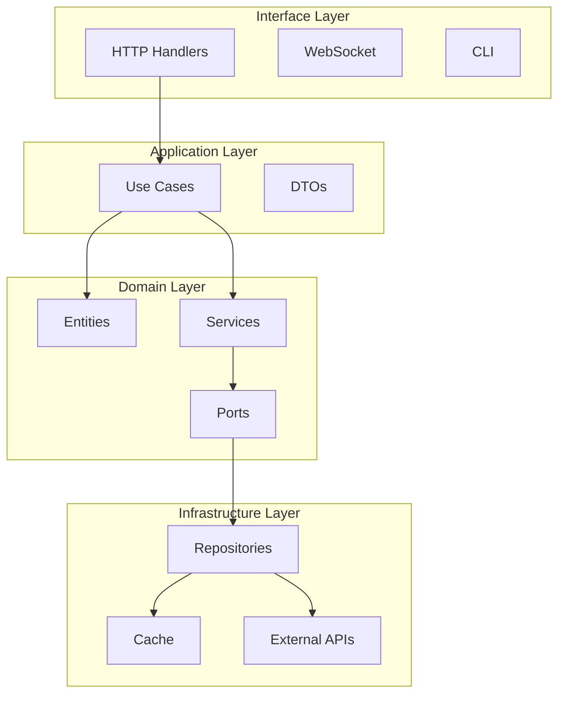

# 🔮 Kusanagi

> **"Your effort to remain what you are is what limits you."**  
> A comprehensive Kubernetes monitoring platform inspired by Ghost in the Shell

<p align="center">
  
</p>

<p align="center">
  <a href="https://www.rust-lang.org/"></a>
  <a href="LICENSE"></a>
  
  
  
</p>

<p align="center">
  <a href="#-quick-start">Quick Start</a> •
  <a href="#-features">Features</a> •
  <a href="#-documentation">Documentation</a> •
  <a href="#-contributing">Contributing</a>
</p>

---

## 🚀 Quick Start

### Docker (30 seconds)

```bash
docker run -p 8080:8080 \
  -v ~/.kube:/home/kusanagi/.kube:ro \
  ghcr.io/jzacharie/kusanagi:latest
```

Then open: http://localhost:8080

### Kubernetes (Helm)

```bash
helm repo add kusanagi https://jzacharie.github.io/helmscharts
helm install kusanagi kusanagi/kusanagi \
  --namespace kusanagi \
  --create-namespace
```

### Development

```bash
# Clone
git clone https://github.com/JZacharie/Kusanagi.git
cd Kusanagi

# Run
make run

# Or with hot reload
cargo watch -x run
```

---

## 📸 Preview

<p align="center">
  
</p>

---

## ✨ Features

| Feature | Description | Status |
|---------|-------------|--------|
| 📊 **Real-time Monitoring** | 462 pods, 16 nodes, 447 services | ✅ Live |
| 🔄 **GitOps Integration** | ArgoCD 183 applications | ✅ Live |
| 🔒 **Security Scanning** | Trivy + AI enrichment | ✅ Live |
| 🌐 **Network Observability** | Cilium/Hubble flows | ✅ Live |
| 🤖 **AI Assistant** | LLM-powered cluster analysis | ✅ Live |
| 📱 **PWA Ready** | Mobile-optimized | ✅ Live |

---

## 🏗️ Architecture



---

## 📖 Documentation

- [Getting Started](docs/getting-started.md) - Installation et configuration
- [API Reference](https://petstore.swagger.io/?url=https://raw.githubusercontent.com/JZacharie/Kusanagi/main/openapi.json) - Documentation API complète
- [Architecture](src/ARCHITECTURE.md) - Guide d'architecture
- [Contributing](CONTRIBUTING.md) - Guide de contribution

---

## 🔧 Configuration

### Environment Variables

```bash
# Server
BIND_ADDR=0.0.0.0:8080
RUST_LOG=info

# Kubernetes
KUBECONFIG=/path/to/kubeconfig

# Optional: ArgoCD
ARGOCD_SERVER=argocd-server.argocd.svc
ARGOCD_TOKEN=your-token

# Optional: AI/LLM
OLLAMA_URL=http://ollama:11434
OPENAI_API_KEY=sk-...
```

See [Configuration Reference](docs/configuration.md) for all options.

---

## 📊 Performance

- **Memory Usage**: ~50MB baseline
- **Response Time**: <100ms for cached data
- **Concurrent Users**: 100+ supported
- **Cache Hit Rate**: >90%

---

## 🤝 Contributing

We welcome contributions! Please see our [Contributing Guide](CONTRIBUTING.md).

```bash
# Setup development environment
./scripts/dev-setup.sh

# Run tests
make test

# Format code
make fmt

# Build release
make build
```

### Good First Issues

- [ ] Add unit tests for domain services (#1)
- [ ] Improve error messages (#2)
- [ ] Add more Prometheus metrics (#3)

---

## 📜 License

MIT License - see [LICENSE](LICENSE) for details.

---

<p align="center">
  Built with ❤️ by the community<br>
  <strong>Kusanagi v0.2.0</strong>
</p>
