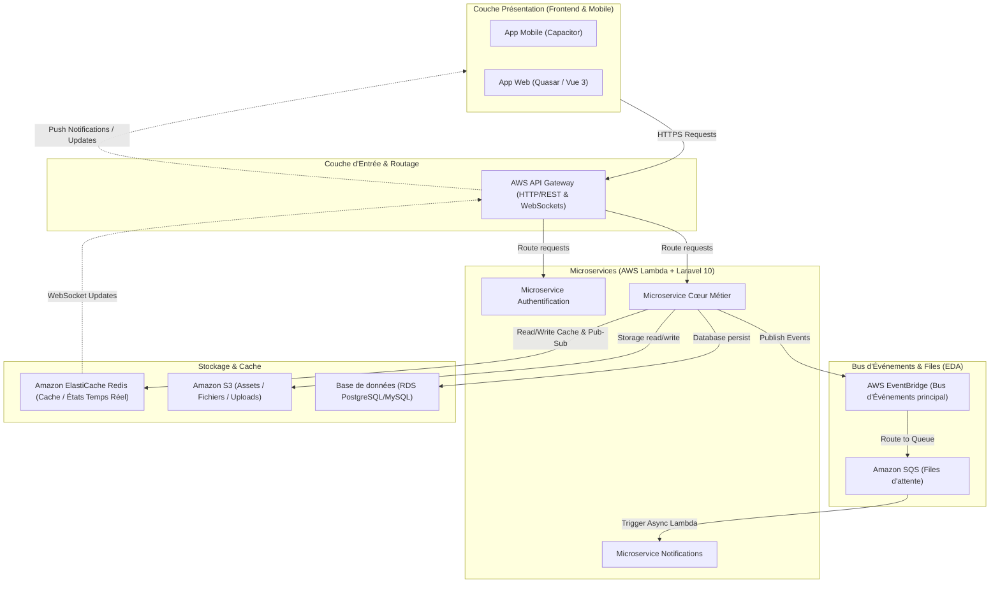

# Proposition d'Architecture EDA (Event-Driven Architecture) - Projet Lab

Cette proposition décrit une architecture orientée événements (EDA) basée sur des microservices exécutés sur **AWS Lambda (Laravel 10 / Bref)**, avec un frontend web **Quasar Framework**, une application mobile **Capcapacitor**, ainsi que **Redis**, **Amazon SQS** et **Amazon S3**.

---

## 1. Schéma Global de l'Architecture

---

## 2. Rôles et Choix des Composants

### A. Couche Présentation (Quasar + Capacitor)
*   **Quasar Framework (Vue 3)** : Choisi pour sa capacité à générer à la fois une application Web (SPA/PWA) extrêmement fluide et performante à partir d'une base de code unique.
*   **Capacitor** : Permet d'encapsuler l'application Quasar pour les plateformes mobiles (iOS/Android). Capacitor offre un accès direct aux APIs natives (caméra, géolocalisation, notifications push) avec un bridge moderne et plus performant que Cordova.

### B. Couche Serveur (AWS Lambda + Laravel 10 + Bref)
*   **Laravel 10** : Framework PHP robuste avec un excellent écosystème (Eloquent ORM, Job Queues, Event Listeners).
*   **Bref.sh** : Outil indispensable pour exécuter des applications PHP/Laravel sur AWS Lambda de manière transparente (Runtime Custom Lambda PHP).
*   **AWS Lambda (Serverless)** : Évite la gestion des serveurs, s'adapte automatiquement à la charge (scaling à zéro) et réduit les coûts d'infrastructure pour un projet de type "Lab" ou en démarrage.

### C. Messagerie et Événements (EDA via AWS EventBridge & SQS)
*   **AWS EventBridge (Recommandé en complément de SQS)** : Agit comme le bus d'événements central. Lorsqu'un microservice (ex: *MS_Core*) produit un événement (ex: `OrderCreated`), il le publie sur EventBridge. EventBridge filtre et route cet événement vers les cibles appropriées.
*   **Amazon SQS** : Utilisé comme tampon (buffer) devant les lambdas consommatrices. Les événements routés par EventBridge arrivent dans des files SQS. Les lambdas consommatrices (ex: *MS_Notif*) traitent les messages de SQS de manière asynchrone. Cela assure la résilience : si un microservice est temporairement indisponible, SQS conserve les messages.

### D. Stockage et Cache (S3 & Redis)
*   **Amazon S3** : Stockage d'objets hautement disponible pour tous les fichiers statiques, images téléversées par les utilisateurs ou exports générés par les Lambdas.
*   **Redis (Amazon ElastiCache ou Redis Cloud)** : 
    1.  **Cache rapide** : Pour stocker les sessions et les réponses d'API fréquemment consultées.
    2.  **Verrous distribués (Mutex)** : Pour éviter les conflits d'écriture并发 (concurrence) dans un environnement serverless hautement distribué.
    3.  **Gestion du Temps Réel** : Couplé avec un serveur WebSocket (ex: Laravel Reverb ou AWS API Gateway WebSockets), Redis sert de driver Pub/Sub pour diffuser instantanément des événements du backend vers les clients Quasar/Capacitor.

---

## 3. Flux d'un Événement Type (Exemple : Inscription Utilisateur)

1.  **Action Utilisateur** : L'utilisateur s'inscrit sur l'application mobile Capacitor.
2.  **Requête REST** : L'application envoie une requête HTTP POST `api/register` vers l'**API Gateway**.
3.  **Traitement Synchrone** : L'API Gateway déclenche la Lambda du *MS_Auth*. Celle-ci crée l'utilisateur en base de données, puis émet un événement `UserRegistered`.
4.  **Publication d'Événement** : *MS_Auth* publie l'événement sur **AWS EventBridge**.
5.  **Réponse Immédiate** : La Lambda renvoie un jeton JWT au client mobile. L'utilisateur est connecté sans attendre les traitements secondaires (expérience fluide).
6.  **Routage Asynchrone** : EventBridge capture l'événement `UserRegistered` et le pousse dans une file **SQS** dédiée au service de notification.
7.  **Consommation** : SQS déclenche la Lambda du *MS_Notif* de manière asynchrone pour :
    *   Envoyer un email de bienvenue.
    *   Générer un profil par défaut (stocké sur **S3**).
    *   Notifier d'autres microservices si nécessaire.

---

## 4. Avantages et Défis de cette Architecture

### Avantages
*   **Passage à l'échelle automatique (Autoscaling)** : AWS Lambda gère les pics de trafic sans configuration de serveurs.
*   **Découplage fort** : Les microservices ne se connaissent pas directement. Ils communiquent uniquement via des messages/événements, ce qui facilite la maintenance et les déploiements indépendants.
*   **Résilience** : Si le service d'envoi d'emails tombe en panne, la file SQS conserve les messages jusqu'au rétablissement du service. Aucun événement n'est perdu.
*   **Base de code unifiée pour les clients** : Quasar + Capacitor réduit de moitié le temps de développement de l'interface graphique.

### Défis à anticiper
*   **Cold Starts (Démarrages à froid)** : Les fonctions PHP Lambda peuvent subir un léger délai lors de la première invocation. Bref gère cela très bien, mais il faut optimiser le chargement de Laravel (config:cache, route:cache) et éventuellement utiliser du *Provisioned Concurrency* pour les routes critiques.
*   **Gestion des connexions aux bases de données** : Le serverless peut ouvrir des milliers de connexions simultanées vers la base de données. L'utilisation d'**AWS RDS Proxy** est fortement recommandée pour mutualiser les connexions.
*   **Consistance Éventuelle** : Les données n'étant pas mises à jour instantanément partout en même temps, il faut concevoir l'interface Quasar pour gérer cet état asynchrone (ex: spinners, notifications push temps réel via Redis/WebSockets).
