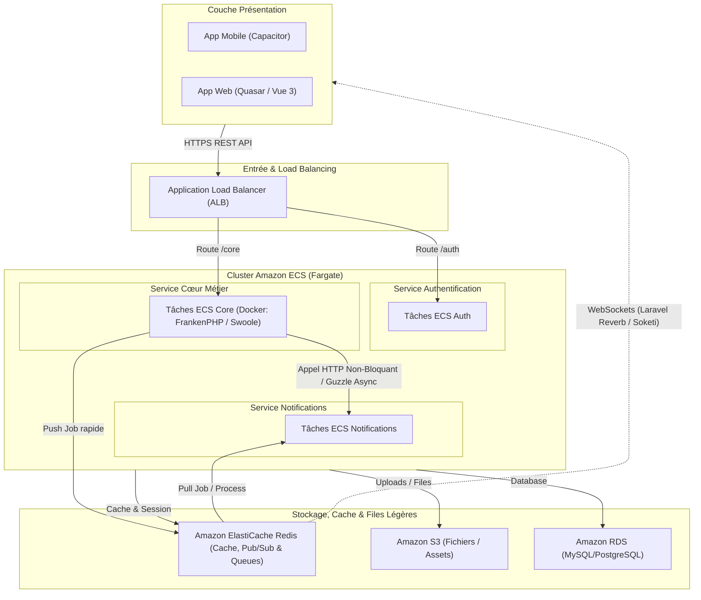

# Architecture Microservices - Appels Asynchrones Directs (Sans Bus de Messages) - Projet Lab

Cette variante d'architecture propose de supprimer le bus d'événements et les files d'attente AWS (Amazon SQS / EventBridge) au profit d'**appels asynchrones directs** entre les microservices ou de l'utilisation de **Redis** (déjà présent) comme courtier de tâches léger.

---

## 1. Schéma de l'Architecture (Appels Async & Redis)



---

## 2. Comment réaliser des appels asynchrones en PHP sans SQS/EventBridge ?

PHP est traditionnellement synchrone (bloquant). Pour faire de l'asynchrone sans bus de messages cloud (SQS), nous avons trois approches principales :

### Option A : Appels HTTP Asynchrones (Non-bloquants)
Le microservice *Core* appelle directement le microservice *Notification* via HTTP sans bloquer son propre thread d'exécution.
*   **Comment ?** En utilisant le client HTTP de Laravel avec des promesses asynchrones (basées sur Guzzle `curl_multi`) ou des bibliothèques comme **Spatie Async**.
*   **Code Laravel exemple** :
    ```php
    use Illuminate\Support\Facades\Http;

    // L'appel est envoyé en tâche de fond, Laravel n'attend pas la réponse pour continuer
    Http::async()->post('http://notification-service/api/notify', [
        'user_id' => $user->id,
        'message' => 'Bienvenue !'
    ]);
    ```

### Option B : Utilisation de FrankenPHP / Swoole (Recommandé pour les conteneurs continus)
Puisque nous utilisons des conteneurs qui tournent en continu, nous pouvons utiliser un serveur d'application moderne comme **FrankenPHP** (basé sur Go) ou **Swoole** à la place du couple classique Nginx + PHP-FPM.
*   **Fonctionnement** : Ces runtimes supportent les **Fibers** (coroutines) et les tâches asynchrones en arrière-plan.
*   **Laravel exemple (FrankenPHP/Swoole Workers)** :
    ```php
    // Envoi d'une tâche asynchrone gérée par le serveur d'application en arrière-plan
    // sans bloquer la requête HTTP de l'utilisateur
    dispatch(function () {
        // Traitement long (ex: appel API externe, génération de fichier sur S3)
    })->afterResponse();
    ```

### Option C : File d'attente Redis locale (La plus robuste sans AWS SQS)
Puisque **Redis** est déjà présent dans la stack pour le cache et le temps réel, nous pouvons l'utiliser comme broker de file d'attente léger avec le driver `redis` natif de Laravel.
*   **Avantage** : Vous supprimez le coût et la complexité d'Amazon SQS tout en gardant une file d'attente résiliente.
*   **Fonctionnement** : *Core* pousse un Job dans Redis, et le worker du service *Notification* (qui tourne aussi en continu sur ECS) récupère et traite ce Job.

---

## 3. Avantages et Inconvénients de cette approche "Sans Bus"

### Avantages
*   **Simplification de l'infra AWS** : Moins de ressources à configurer et à payer (pas de files SQS à gérer, pas de règles EventBridge).
*   **Faible Latence** : Les appels directs HTTP ou via Redis local sont extrêmement rapides.
*   **Excellent pour le Lab** : Beaucoup plus facile à tester en local (un simple `docker-compose` avec Redis suffit, pas besoin de simuler SQS/EventBridge).

### Inconvénients / Limites
*   **Couplage Temporel (pour les appels HTTP directs)** : Si le service *Notification* est en panne lors de l'appel HTTP asynchrone, le message est perdu à moins d'implémenter une logique complexe de retry/backoff dans le code du service émetteur.
*   **Gestion des pannes complexe** : Sans Dead Letter Queue (DLQ) native comme sur SQS, la gestion des messages en échec doit être codée manuellement dans Laravel.
